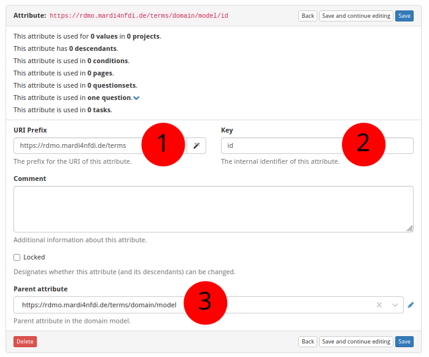

# How to Create a New Attribute in RDMO

The screenshot below (taken in RDMO 2.4.4) shows the form for creating a new
attribute.  The numbered fields are explained in the sections that follow.



---

**① URI prefix**

The base URI that scopes all items belonging to a particular source.
For MaRDMO-specific items this is:

```
https://rdmo.mardi4nfdi.de/terms
```

**② Key**

A short identifier for the attribute.  Together with the parent attribute (see
below), this determines the attribute's full URI.  Example:

```
id
```

**③ Parent**

The parent attribute under which this attribute is nested.  Setting the parent
to `model` and the key to `id` produces the full attribute URI:

```
https://rdmo.mardi4nfdi.de/terms/domain/model/id
```
