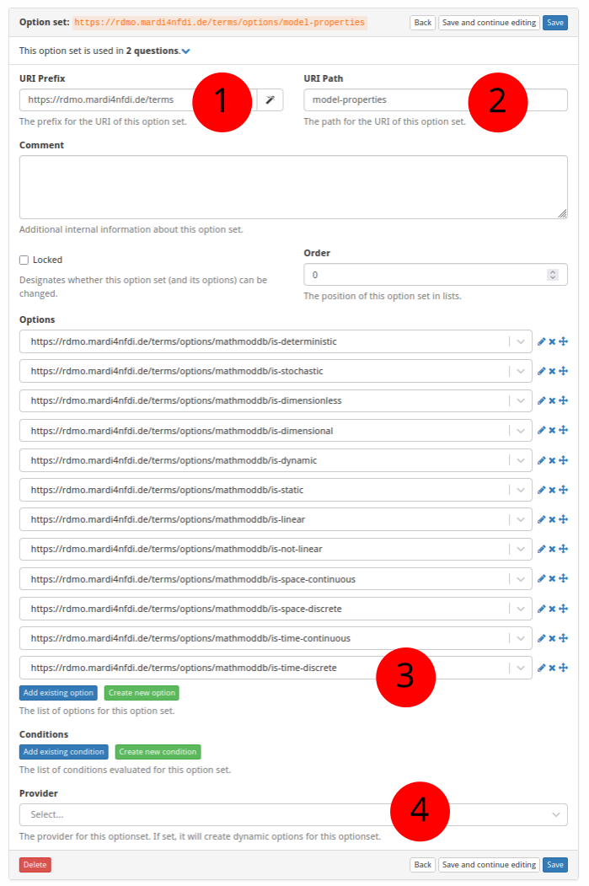

# How to Create a New Optionset in RDMO

The screenshot below (taken in RDMO 2.4.4) shows the form for creating a new
optionset.  The numbered fields are explained in the sections that follow.



---

**① URI prefix**

The base URI that scopes all items belonging to a particular source.
For MaRDMO-specific items this is:

```
https://rdmo.mardi4nfdi.de/terms
```

**② URI path**

A short name that identifies the optionset.  This becomes part of the
optionset's full URI.  Example:

```
model-properties
```

The full URI of the optionset is therefore:

```
https://rdmo.mardi4nfdi.de/terms/options/model-properties
```

**③ Options**

Assign existing options to this optionset, or create new ones directly from
this form.  See [How to create a new Option in RDMO](add-option-rdmo.md) for
details on adding individual options.

**④ Provider**

Optionally attach an external optionset provider to supply options
dynamically — for example, via an autocomplete search against the MaRDI Portal
or Wikidata.  A provider can be used alongside manually defined static options
or on its own.  See [Dynamic Optionset Providers](../concepts/providers.md) for
a description of the available provider tiers and how they work.
