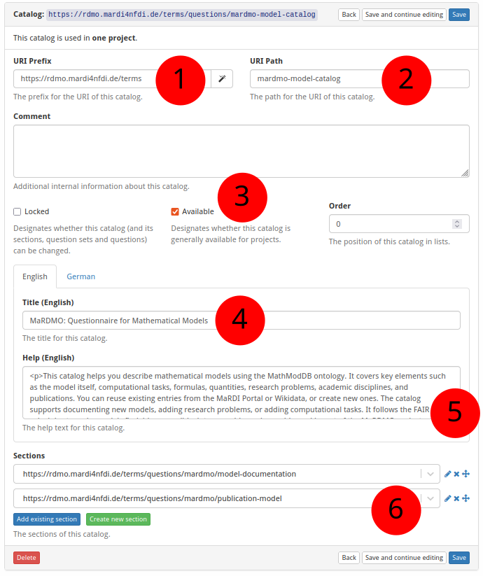

# How to Create a New Catalog

The screenshot below (taken in RDMO 2.4.4) shows the form for creating a new
catalog.  The numbered fields are explained in the sections that follow.



**① URI prefix** — The base URI that scopes all items belonging to a particular source. For MaRDMO-specific items this is: `https://rdmo.mardi4nfdi.de/terms`

**② URI path** — The path that uniquely identifies this catalog within the prefix. MaRDMO catalogs follow the pattern `mardmo-<datatype>-catalog`, where `<datatype>` is one of `model`, `algorithm`, or `workflow`. Here: `mardmo-model-catalog`. Together with the prefix this yields the full URI `https://rdmo.mardi4nfdi.de/terms/questions/mardmo-model-catalog`.

**③ Available for projects** — If enabled, the catalog can be selected by users when creating a new project. Here: yes.

**④ Title** — The label displayed as the catalog name, in English and German. Here:

- **English:** `MaRDMO: Questionnaire for Mathematical Models`
- **German:** `MaRDMO: Fragenkatalog für mathematische Modelle`

**⑤ Help text** — Optional description shown to users when selecting the catalog. Accepts HTML formatting, provided in English and German. Here:

**English:**

```html
<p>This catalog helps you describe mathematical models using the MathModDB ontology. It covers key elements such as the model itself, computational tasks, formulas, quantities, research problems, academic disciplines, and publications. You can reuse existing entries from the MaRDI Portal or Wikidata, or create new ones. The catalog supports documenting new models, adding research problems, or adding computational tasks. It follows the FAIR principles to make models findable, accessible, interoperable, and reusable, and is part of the MaRDMO project developed within the MaRDI initiative. Completed documentations can be exported directly to the MaRDI Portal.</p>

<p>Check out <a href="https://www.youtube.com/watch?v=UmbBNUZJ994&list=PLgoPZ7uPWbo-jqDXzx4fSm_4JyAYEMPjn">MaRDMO Model Documentation</a> showcasing the documentation and subsequent export.</p>
```

**German:**

```html
<p>Dieser Katalog hilft dabei, mathematische Modelle anhand der MathModDB-Ontologie zu beschreiben. Er umfasst zentrale Elemente wie das Modell selbst, Berechnungsaufgaben, Formeln, Größen, Forschungsprobleme, wissenschaftliche Disziplinen und Publikationen. Bestehende Einträge aus dem MaRDI-Portal oder Wikidata können wiederverwendet oder neue erstellt werden. Der Katalog unterstützt die Dokumentation neuer Modelle, das Hinzufügen von Forschungsproblemen oder Berechnungsaufgaben. Er folgt den FAIR-Prinzipien, um Modelle auffindbar, zugänglich, interoperabel und wiederverwendbar zu machen, und ist Teil des MaRDMO-Projekts innerhalb der MaRDI-Initiative. Abgeschlossene Dokumentationen können direkt in das MaRDI-Portal exportiert werden.</p>

<p>Sehen Sie sich <a href="https://www.youtube.com/watch?v=UmbBNUZJ994&list=PLgoPZ7uPWbo-jqDXzx4fSm_4JyAYEMPjn">MaRDMO Model Documentation</a> an, in dem die Dokumentation und der anschließende Export vorgestellt werden.</p>
```

**⑥ Sections** — Add existing sections to this catalog or create new ones (see [How to Create a New Section](add-section.md)).
