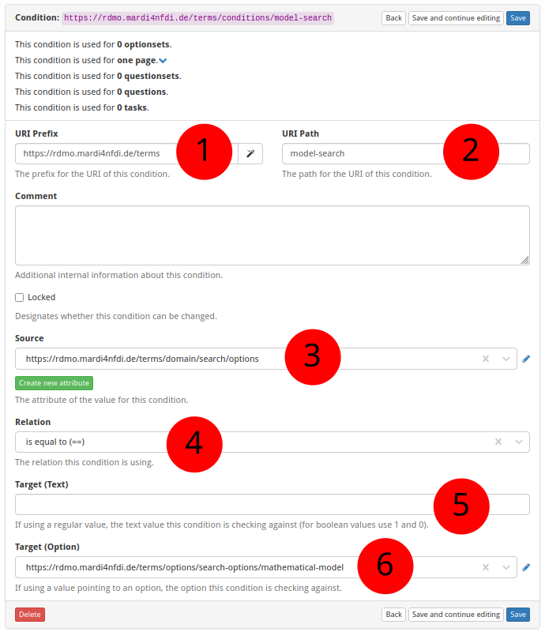

# How to Create a New Condition

The screenshot below (taken in RDMO 2.4.4) shows the form for creating a new
condition.  The numbered fields are explained in the sections that follow.



---

**① URI prefix**

The base URI that scopes all items belonging to a particular source.
For MaRDMO-specific items this is:

```
https://rdmo.mardi4nfdi.de/terms
```

**② URI path**

A short name that identifies the condition.  This becomes part of the
condition's full URI.  Example:

```
model-search
```

The full URI of the condition is therefore:

```
https://rdmo.mardi4nfdi.de/terms/conditions/model-search
```

**③ Source attribute**

The URI of the attribute whose value is evaluated by this condition.  The
condition checks the answer stored under this attribute in the current project.
An existing attribute can be selected from the list, or a new one created
first — see [How to Create a New Attribute](add-attribute.md).

**④ Relation**

The comparison operator applied to the source value.  Example: *is equal to*.
RDMO supports a fixed set of relations such as equal, not equal, contains,
greater than, and so on.

**⑤ Target value (text)**

The string the source value is compared against when the relation operates on
free-text answers.

**⑥ Target value (option)**

The option the source value is compared against when the relation operates on
option-based answers (i.e. when the source attribute is backed by an
optionset).  An existing option can be selected from the list.
