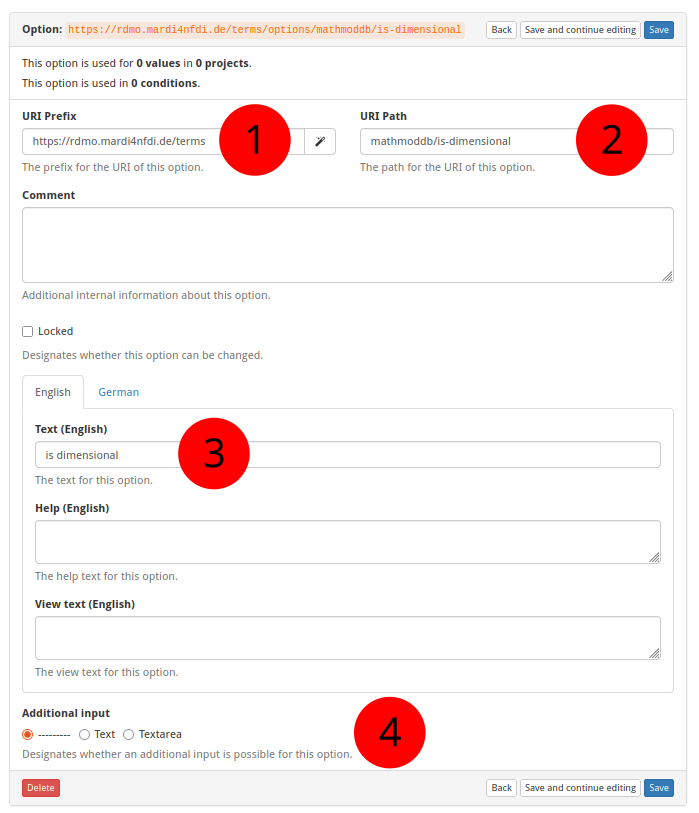

# How to Create a New Option

The screenshot below (taken in RDMO 2.4.4) shows the form for creating a new
option.  The numbered fields are explained in the sections that follow.



---

**① URI prefix**

The base URI that scopes all items belonging to a particular source.
For MaRDMO-specific items this is:

```
https://rdmo.mardi4nfdi.de/terms
```

**② URI path**

The path that encodes the vocabulary and the individual option, appended to the
prefix.  It consists of two parts separated by a slash:

- the vocabulary name (e.g. `mathmoddb`)
- a slug identifying the option (e.g. `is-dimensional`)

Example for the *Is Dimensional* option:

```
mathmoddb/is-dimensional
```

The full URI of the option is therefore:

```
https://rdmo.mardi4nfdi.de/terms/options/mathmoddb/is-dimensional
```

**③ Labels**

The English and German labels of the option that are displayed to the user in
the interview.  Both language variants should be filled in so that the
interview renders correctly regardless of the user's language setting.

**④ Additional input**

Controls whether the option presents an extra text field next to the checkbox
in the interview.  Leave this off for pure boolean properties (e.g. *Is
Dimensional*).  Enable it when the option requires supplementary data from the
user — for example, the *DOI* option provides a text field where the user can
enter the actual DOI string.
