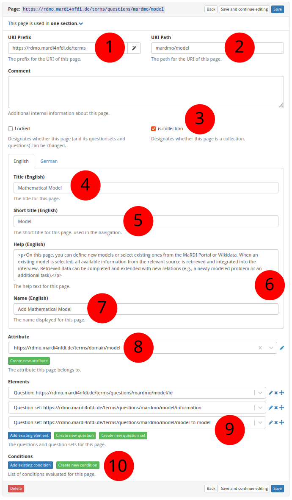

# How to Create a New Page

The screenshot below (taken in RDMO 2.4.4) shows the form for creating a new
page.  The numbered fields are explained in the sections that follow.



**① URI prefix** — The base URI that scopes all items belonging to a particular source. For MaRDMO-specific items this is: `https://rdmo.mardi4nfdi.de/terms`

**② URI path** — The path that uniquely identifies this page within the prefix. For MaRDMO pages this starts with `mardmo` followed by the entity class, e.g. `mardmo/model`. Together with the prefix this yields the full URI `https://rdmo.mardi4nfdi.de/terms/questions/mardmo/model`.

**③ Is collection** — If enabled, the page can appear multiple times per interview, allowing users to document several instances of the same entity. Here: collection.

**④ Title** — The label displayed as the page heading, in English and German. Here:

- **English:** `Mathematical Model`
- **German:** `Mathematisches Modell`

**⑤ Short title** — An abbreviated title shown in the interview navigation, in English and German. Here:

- **English:** `Model`
- **German:** `Modell`

**⑥ Help text** — Optional guidance shown at the top of the page. Accepts HTML formatting, provided in English and German. Here:

**English:**

```html
<p>On this page, you can define new models or select existing ones from the MaRDI Portal or Wikidata. When an existing model is selected, all available information from the relevant source is retrieved and integrated into the interview. Retrieved data can be completed and extended with new relations (e.g., a newly modeled problem or an additional task).</p>

<p>In addition to enhancing existing models, they can also serve as templates for creating new ones. To use a model as a template, the reference to the external source must be removed after importing the available information.</p>

<p>For a smooth export to the MaRDI Portal, all <strong>non-optional</strong> questions must be answered completely.</p>

<p><strong>Note:</strong> If a model is selected from the MaRDI Portal and not used as a template, its existing information <u>cannot</u> be edited or deleted via MaRDMO. Any changes or deletions made regardless will be ignored or shown alongside the original information in the MaRDI Portal.</p>

<p>Check out <a href="https://www.youtube.com/watch?v=UmbBNUZJ994&t=3s">Mathematical Model</a> showcasing the documentation.</p>
```

**German:**

```html
<p>Auf dieser Seite können neue Modelle definiert oder bereits bestehende Modelle aus dem MaRDI Portal oder Wikidata ausgewählt werden. Wird ein bestehendes Modell ausgewählt, werden alle verfügbaren Informationen aus der jeweiligen Quelle abgerufen und in das Interview integriert. Die abgerufenen Informationen können ergänzt und um neue Relationen erweitert werden (z.&nbsp;B. ein neues modelliertes Forschungsproblem oder eine zusätzliche verwendete Berechnungsaufgabe).</p>

<p>Bestehende Modelle können nicht nur erweitert, sondern auch als Vorlage für neue Modelle verwendet werden. Hierfür ist es erforderlich, nach dem Abruf der Informationen den Bezug zur externen Quelle zu entfernen.</p>

<p>Für einen reibungslosen Export in das MaRDI Portal müssen alle <strong>nicht-optionalen</strong> Fragen vollständig beantwortet sein.</p>

<p><strong>Hinweis:</strong> Wird ein Modell aus dem MaRDI Portal ausgewählt und nicht als Vorlage verwendet, können bestehende Informationen über MaRDMO <u>nicht</u> editiert oder gelöscht werden. Änderungen oder Löschungen, die dennoch vorgenommen werden, werden ignoriert oder zusätzlich zu den bestehenden Informationen im MaRDI Portal angezeigt.</p>

<p>Sehen Sie sich <a href="https://www.youtube.com/watch?v=UmbBNUZJ994&t=3s">Mathematical Model</a> an in dem die Dokumentation vorgestellt wird.</p>
```

**⑦ Button text** — The label of the button that adds a new instance when the page is a collection, in English and German. Here:

- **English:** `Add Mathematical Model`
- **German:** `Mathematisches Modell Hinzufügen`

**⑧ Attribute** — Optionally links the page to an attribute. An existing attribute can be selected or a new one created (see [How to Create a New Attribute](add-attribute.md)).

**⑨ Questions and question sets** — Add existing questions or question sets to this page, or create new ones (see [How to Create a New Question](add-question.md) and [How to Create a New Question Set](add-questionset.md)).

**⑩ Condition** — Optionally restrict when this page is shown. An existing condition can be selected or a new one created (see [How to Create a New Condition](add-condition.md)).
