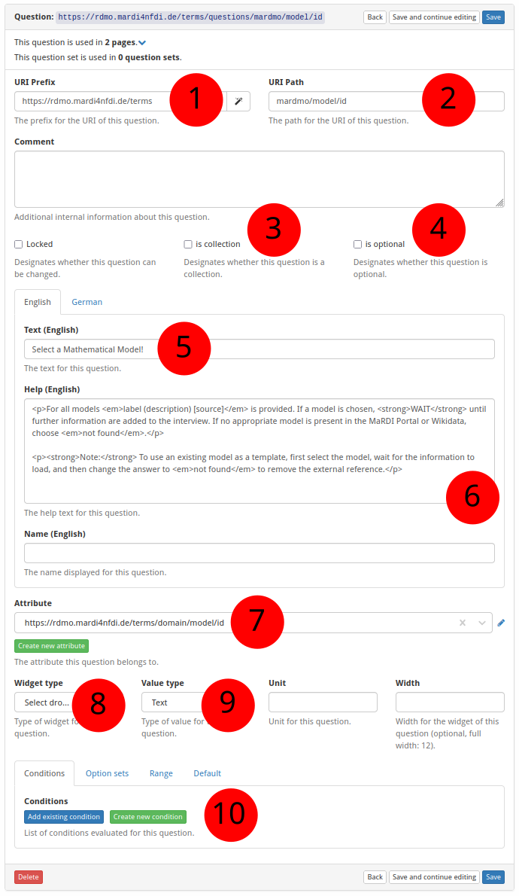

# How to Create a New Question

<figure>
  
</figure>

**① URI prefix** — The base URI that scopes all items belonging to a particular source. For MaRDMO-specific items this is: `https://rdmo.mardi4nfdi.de/terms`

**② URI path** — The path that uniquely identifies this question within the prefix. For MaRDMO questions this always starts with `mardmo`, followed by the entity class and a key, e.g. `mardmo/model/id`. Together with the prefix this yields the full URI `https://rdmo.mardi4nfdi.de/terms/questions/mardmo/model/id`.

**③ Is collection** — If enabled, several answers can be provided for this question. Here: not a collection.

**④ Is optional** — Optional questions are not counted in the progress bar when left unanswered. Here: not optional.

**⑤ Question text** — The question displayed to users, in English and German. Here:

- English: `Select a Mathematical Model!`
- German: `Wählen Sie ein mathematisches Modell aus.`

**⑥ Help text** — Additional guidance shown to users alongside the question. Accepts HTML formatting, provided in English and German. Here:

=== "English"

    ```html
    <p>For all models <em>label (description) [source]</em> is provided. If a model is chosen, <strong>WAIT</strong> until further information are added to the interview. If no appropriate model is present in the MaRDI Portal or Wikidata, choose <em>not found</em>.</p>

    <p><strong>Note:</strong> To use an existing model as a template, first select the model, wait for the information to load, and then change the answer to <em>not found</em> to remove the external reference.</p>
    ```

=== "German"

    ```html
    <p>Für alle Modelle wird <em>Name (Beschreibung) [Quelle]</em> angegeben. Wenn ein Modell ausgewählt wird, <strong>WARTEN</strong> Sie, bis weitere Informationen zum Interview hinzugefügt werden. Falls kein passendes Modell im MaRDI Portal oder Wikidata vorhanden ist, wählen Sie <em>not found</em>.</p>

    <p><strong>Hinweis:</strong> Um ein bestehendes Modell als Vorlage zu verwenden, wählen Sie zunächst das Modell aus, warten Sie, bis alle Informationen geladen wurden, und setzen Sie anschließend die Antwort auf <em>not found</em>, um den Bezug zur externen Quelle zu entfernen.</p>
    ```

**⑦ Attribute** — The attribute this question is linked to. An existing attribute can be selected or a new one created (see [How to Create a New Attribute](add-attribute.md)). Here: `https://rdmo.mardi4nfdi.de/terms/domain/model/id`

**⑧ Widget type** — Controls the input element shown to the user. *Select Dropdown* provides a dropdown with autocomplete; other options include Text, Checkboxes, and more. Here: Select Dropdown.

**⑨ Value type** — The expected data type of the answer, e.g. Text, Integer, Float. When `PROJECT_VALUES_VALIDATION = True` is set in the configuration, answers of the wrong format result in a validation error and cannot be saved; this flag defaults to `False`. Here: Text.

**⑩ Conditions and optionsets** — One or more conditions or optionsets can be attached to a question. Existing entries can be selected or new ones created (see [How to Create a New Condition](add-condition.md) and [How to Create a New Optionset](add-optionset.md)). Here: `https://rdmo.mardi4nfdi.de/terms/options/model` as optionset.
