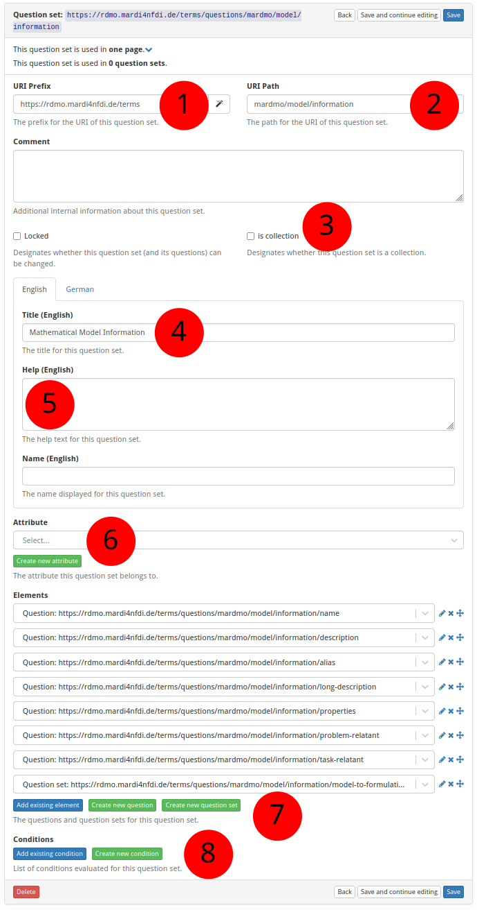

# How to Create a New Question Set

The screenshot below (taken in RDMO 2.4.4) shows the form for creating a new
question set.  The numbered fields are explained in the sections that follow.

**① URI prefix** — The base URI that scopes all items belonging to a particular source. For MaRDMO-specific items this is: `https://rdmo.mardi4nfdi.de/terms`

**② URI path** — The path that uniquely identifies this question set within the prefix. For MaRDMO question sets this always starts with `mardmo`, followed by the entity class and a key, e.g. `mardmo/model/information`. Together with the prefix this yields the full URI `https://rdmo.mardi4nfdi.de/terms/questions/mardmo/model/information`.

**③ Is collection** — If enabled, the question set can appear multiple times per interview page, allowing users to document several instances of the same entity. Here: not a collection.

**④ Title** — The label displayed as the question set heading, in English and German. Here:

- **English:** `Mathematical Model Information`
- **German:** `Mathematisches Modell Informationen`

**⑤ Help text** — Optional additional guidance shown alongside the question set heading. Accepts HTML formatting, provided in English and German. Here: not provided.

**⑥ Attribute** — Optionally links the question set to an attribute. An existing attribute can be selected or a new one created (see [How to Create a New Attribute](add-attribute.md)).

**⑦ Questions and question sets** — Add existing questions or question sets to this question set, or create new ones (see [How to Create a New Question](add-question.md)). Question sets can be nested.

**⑧ Condition** — Optionally restrict when this question set is shown. An existing condition can be selected or a new one created (see [How to Create a New Condition](add-condition.md)).
