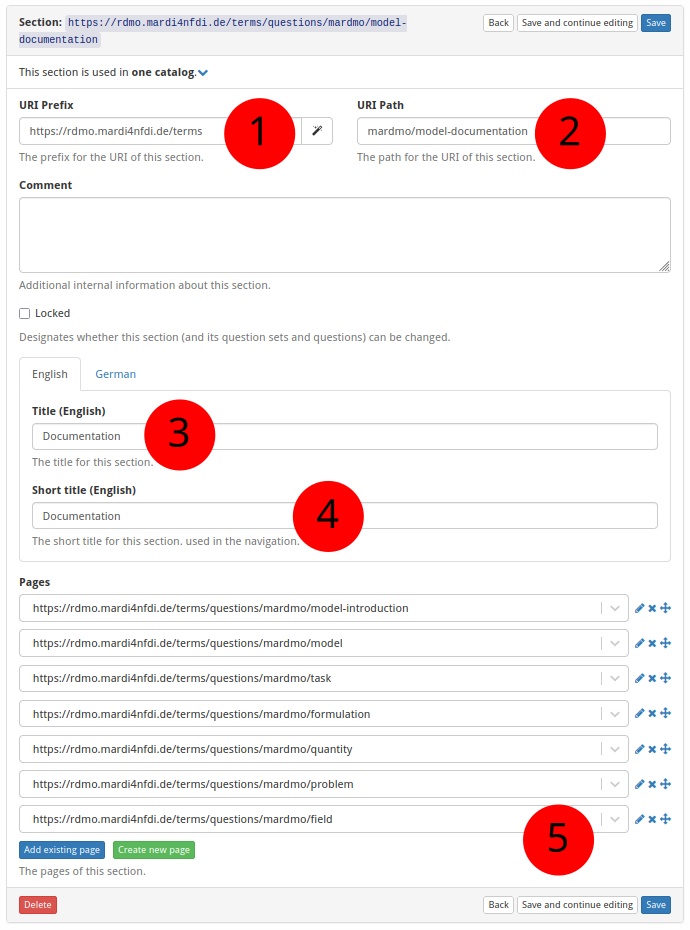

# How to Create a New Section

The screenshot below (taken in RDMO 2.4.4) shows the form for creating a new
section.  The numbered fields are explained in the sections that follow.

**① URI prefix** — The base URI that scopes all items belonging to a particular source. For MaRDMO-specific items this is: `https://rdmo.mardi4nfdi.de/terms`

**② URI path** — The path that uniquely identifies this section within the prefix. Each MaRDMO catalog contains two sections. The documentation section follows the pattern `mardmo/<datatype>-documentation`, e.g. `mardmo/model-documentation` for the model catalog. The reference section follows the pattern `publication-<datatype>`, e.g. `publication-model`. Together with the prefix the documentation section yields the full URI `https://rdmo.mardi4nfdi.de/terms/questions/mardmo/model-documentation`.

**③ Title** — The label displayed as the section heading, in English and German. Here (documentation section):

- **English:** `Documentation`
- **German:** `Dokumentation`

**④ Short title** — An abbreviated title shown in the interview navigation, in English and German. Here:

- **English:** `Documentation`
- **German:** `Dokumentation`

**⑤ Pages** — Add existing pages to this section or create new ones (see [How to Create a New Page](add-page.md)).
